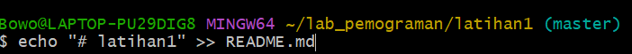
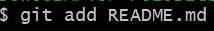
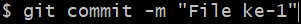
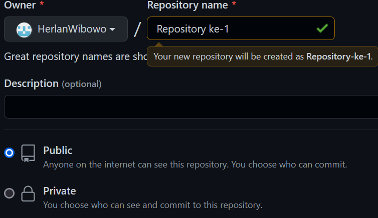

#Latihan 1: Penggunaan GIT
### Nama  : Herlan Wibowo
### NIM   : 312210324
### Matkul: Bahasa pemograman
### kelas : TI 22 A3
#### cara menggunakan git dan membuat file README.md
#### 1.Download git di ***(git-scm.com)***

#### 2.Buka Git Bash lalu kita membuat direktory dengan menjalankan perintah $mkdir latihan1 setelah itu masuk kedalam direktori tersebut dengan ***$cd latihan1***
#### 3.Buat repository lokal dengan **$git init** jika sudah maka akan terbuat directory hidden beernama .git
#### 4.Lalu buat file bernama README.md dengan menjalankan ***$ echo "# latihan1" >> README.md***

#### 5.Tambahkan file baru yang saja dibuat menggunakan ***$git add README.md***

#### 6.Untuk menyimpan perubahan yang ada pada reposiotry local gunakan ***git commit -m "komentar commit"***

#### 7.-Kita akan membuat repository server menggunakan ***http://github.com***
       -Anda harus membuat akun terlebih dahulu.
       -Pada laman github, klik tombol start a project, atau
       -Dari menu (icon +) klik New Repository
       -isi nama repository misal :Repository ke-1
       -lalu klik tombol create repository
       -kita juga bisa jika ingin membuat repository kita tidak ingin di lihat orang banyak klik ***private*** jika ingin sebaliknya klik ***publik***
       
