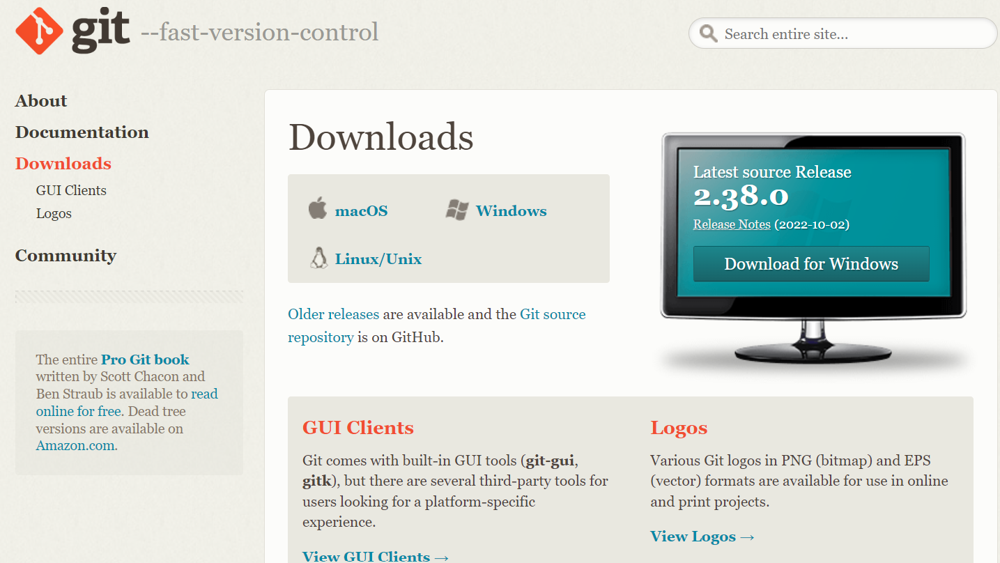

#Latihan 1: Penggunaan GIT
### Nama  : Herlan Wibowo
### NIM   : 312210324
### Matkul: Bahasa pemograman
### kelas : TI 22 A3
#### cara menggunakan git dan membuat file README.md
#### 1.Download git di (git-scm.com)

#### 2.Buka Git Bash lalu kita membuat direktory dengan menjalankan perintah $mkdir latihan1 setelah itu masuk kedalam direktori tersebut dengan $cd latihan1
#### 3.Buat repository lokal dengan $git init jika sudah maka akan terbuat directory hidden beernama .git
